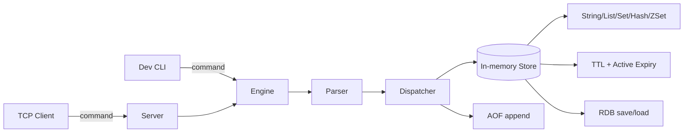
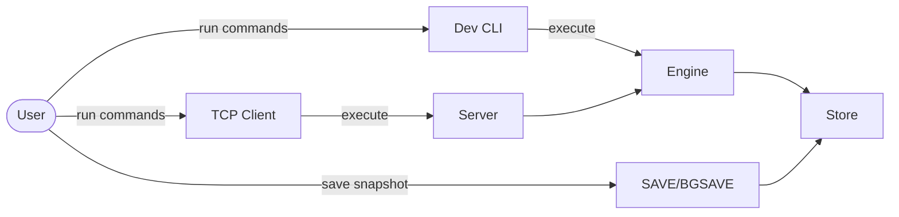
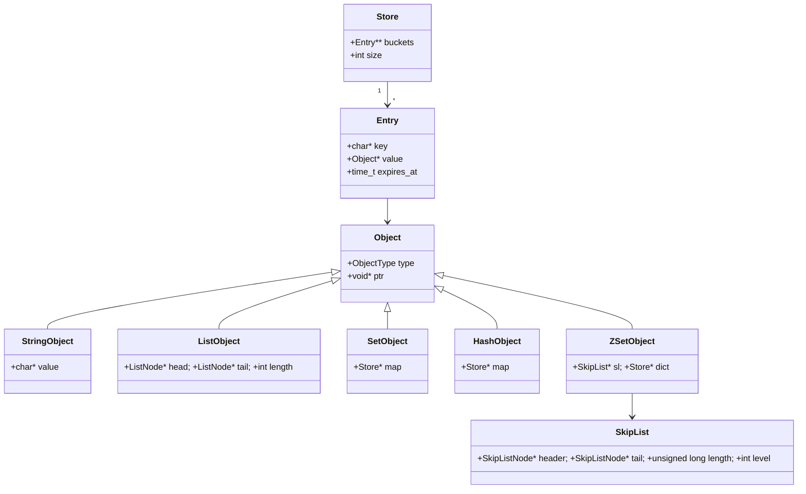
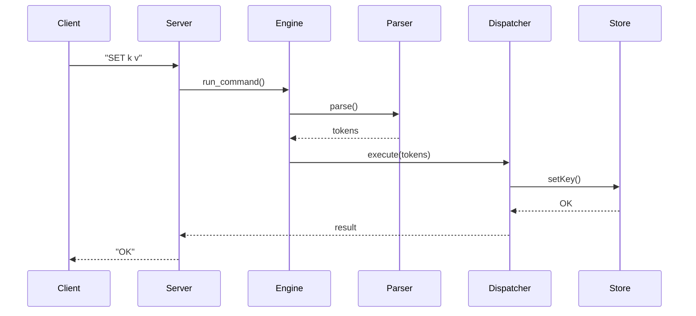
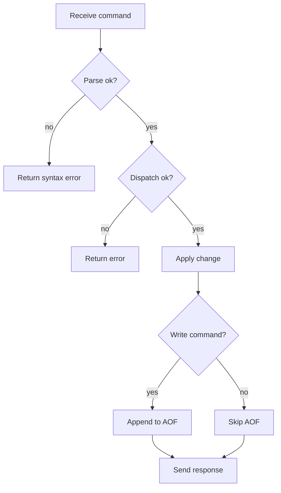
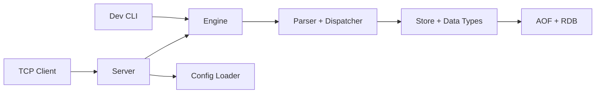
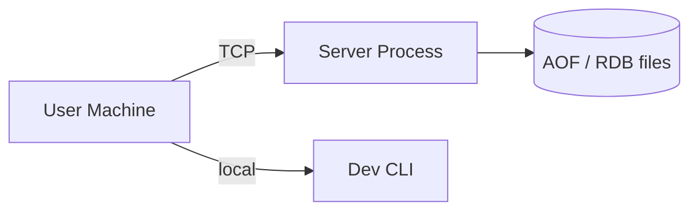

# Documentation

## 1. Introduction

### 1.1 Background
Mini Redis is a lightweight in-memory key-value database implemented in C. It mirrors a small subset of Redis features to study data structures, command processing, and persistence techniques.

### 1.2 Problem Statement
Build a minimal Redis-like system that supports multiple data types, TTL-based expiry, and persistence while providing both a local CLI and a TCP server interface.

### 1.3 Objectives
- Implement a small, fast in-memory store with strings, lists, sets, hashes, and sorted sets.
- Provide a simple command language with validation and helpful errors.
- Support TTLs with lazy and active expiry.
- Add persistence via append-only logging and snapshotting.
- Offer both an in-process CLI and a TCP server plus client.
- Validate correctness with automated tests.

### 1.4 Overview
The system accepts text commands, parses them into tokens, dispatches to data type handlers, and returns formatted responses. The engine runs in two modes: an in-process dev CLI and a multi-threaded TCP server. Persistence is handled by an append-only file (AOF) for write commands and an RDB-style snapshot for full-database saves.

## 2. Literature Review

### 2.1
In-memory key-value stores are commonly used for caching, session state, and fast lookups. Their design favors low latency by keeping working data in RAM and providing a simple command interface.

### 2.2
Hash tables are a natural fit for key-value databases because they provide average O(1) inserts and lookups. The project uses hash tables with chaining to store keys and to implement sets and hashes.

### 2.3
TTL and expiry are essential for cache-like behavior. A combination of lazy expiry (on read) and active expiry (background scanning) balances correctness with CPU cost.

### 2.4
Persistence in key-value stores often mixes an append-only log for durability and a periodic snapshot for fast recovery. The project implements both AOF replay and RDB snapshots.

### 2.5
Sorted sets typically require ordered access with reasonable update cost. Skip lists are a probabilistic structure that provide average O(log n) insertions and queries, and are widely used in Redis-like systems.

## 3. Requirement Analysis

### 3.1 Functional Requirements
- Support string commands: SET, GET (with optional TTL on SET).
- Support list commands: LPUSH, RPUSH, LPOP, RPOP, LRANGE.
- Support set commands: SADD, SISMEMBER, SMEMBERS.
- Support hash commands: HSET, HGET, HGETALL.
- Support sorted set commands: ZADD, ZSCORE, ZRANK, ZRANGE, ZREM, ZCARD.
- Support TTL commands: EXPIRE, TTL, PERSIST.
- Support utility commands: DEL, TYPE, EXISTS, HELP.
- Support persistence commands: SAVE, BGSAVE.
- Provide a dev CLI (in-process) and a TCP server with a TCP client.
- Load configuration from a text config file with defaults.

### 3.2 Non-Functional Requirements
- Low-latency operations by keeping the dataset in memory.
- Thread-safe command execution in the server using mutexes.
- Data durability via AOF appends and RDB snapshots.
- Predictable memory use and explicit resource cleanup.
- Portable C implementation that builds with a standard GCC toolchain.

## 4. Design

### 4.1 Overview Diagram


### 4.2 UML Diagrams

#### 4.2.1 Use Case Diagram


#### 4.2.2 Class Diagram


#### 4.2.3 Sequence Diagram


#### 4.2.4 Activity Diagram


#### 4.2.5 Component Diagram


#### 4.2.6 Deployment Diagram


### 4.3 Algorithms

#### 4.3.1 Algorithm 1
Hash table with chaining for the main keyspace. Average O(1) insert, lookup, and delete. TTL metadata is stored per entry.

#### 4.3.2
Doubly linked list for list operations. O(1) push and pop at head or tail and O(n) traversal for LRANGE.

#### 4.3.3
Set implemented as a hash table of members. Membership checks are average O(1).

#### 4.3.4
Hash implemented as a nested store mapping fields to string values. Field lookups are average O(1).

#### 4.3.5
Skip list for sorted sets with average O(log n) insert, delete, and rank queries, plus a dictionary for O(1) member lookup.

## 5. Coding, Implementation & Results

### 5.1 Pseudo Code
```
function run_command(input):
	tokens = parse(input)
	if tokens invalid:
		return error
	result = dispatch(tokens)
	return result
```

```
function server_handle_client():
	receive line
	tokens = parse(copy(line))
	result = run_command(line)
	if result OK and is_write_command(tokens):
		append_to_aof(tokens)
	send(result)
```

### 5.2 Explanation of Key Functions
- `parse`: tokenizes input, including quoted strings.
- `execute`: validates command arguments and dispatches to the correct data type handler.
- `run_command`: connects parsing and execution for a single command.
- `aof_append` / `aof_load`: append write commands and replay them at startup.
- `rdb_save` / `rdb_load`: snapshot and restore the full keyspace.
- `activeExpiryCycle`: periodically deletes expired keys.
- `skiplistInsert` / `skiplistDelete`: maintain sorted set ordering.

### 5.3 Method of Implementation
The engine is built around a hash-table store that maps keys to typed objects. Each data type has its own structure and helper functions. The server runs a thread per client and uses a mutex to protect the shared store, while persistence runs via AOF appends and optional RDB snapshots.

#### 5.3.1 Output Screens
Example dev CLI session:
```
Mini Redis Dev CLI  (type EXIT to quit)
mini-redis> SET user alice
OK
mini-redis> GET user
alice
mini-redis> EXPIRE user 60
1
```

Example TCP client session:
```
Connected to Mini Redis at 127.0.0.1:6379
mini-redis> LPUSH mylist a
OK
mini-redis> LRANGE mylist
a
```

#### 5.3.2 Result Analysis
The implementation achieves the expected behavior for all supported commands and data types. AOF replay and RDB load restore correct state, and TTL semantics match the specified return values for missing or persistent keys. Performance is consistent with the underlying data structures (hash tables and skip lists) and is suitable for a learning-scale in-memory database.

## 6. Testing & Validation
The project includes unit and integration tests for core data structures, command execution, and persistence round-trips. Run the full suite with `make test`. Tests cover string, list, set, hash, and sorted set operations, TTL behavior, AOF replay, RDB snapshots, and configuration loading.

## 7. Conclusion
Mini Redis demonstrates how a compact Redis-like system can be built in C using a small set of well-understood data structures. The project delivers a working command engine, persistence options, and a multi-threaded server while remaining easy to study and extend.

## References
1. Redis documentation, https://redis.io/docs
2. William Pugh, "Skip Lists: A Probabilistic Alternative to Balanced Trees", 1990
3. POSIX Threads Programming, https://pubs.opengroup.org/onlinepubs/9699919799/
4. C11 Standard Overview, https://en.cppreference.com/w/c
